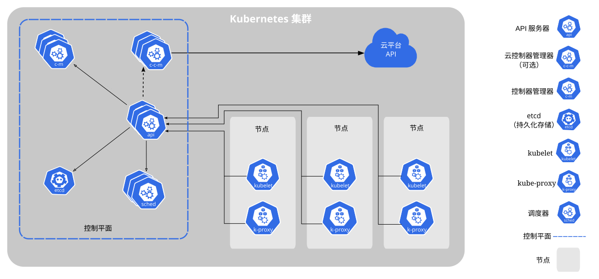

> **来源与授权**：本文转载自 [Kubernetes 官方中文文档：Kubernetes 组件](https://kubernetes.io/zh-cn/docs/concepts/overview/components/)，由 Kubernetes 文档贡献者维护，按 [CC BY 4.0](https://github.com/kubernetes/website/blob/main/LICENSE) 使用。采集于 2026 年 10 月 8 日。
>
> **整理说明**：保留官方中文正文和架构图；删除仅用于维护翻译的英文注释，把原站专用标记转换为本站可显示的格式，并将相关文档链接指回 Kubernetes 官网。本文是采集日期的文档快照。

本文档概述了一个正常运行的 Kubernetes 集群所需的各种组件。

## 核心组件

Kubernetes 集群由控制平面和一个或多个工作节点组成。以下是主要组件的简要概述：

### 控制平面组件

这些控制平面组件（Control Plane Component）管理集群的整体状态：

[kube-apiserver](https://kubernetes.io/zh-cn/docs/concepts/architecture/#kube-apiserver)
: 公开 Kubernetes HTTP API 的核心组件服务器。

[etcd](https://kubernetes.io/zh-cn/docs/concepts/architecture/#etcd)
: 具备一致性和高可用性的键值存储，用于所有 API 服务器的数据存储。

[kube-scheduler](https://kubernetes.io/zh-cn/docs/concepts/architecture/#kube-scheduler)
: 查找尚未绑定到节点的 Pod，并将每个 Pod 分配给合适的节点。

[kube-controller-manager](https://kubernetes.io/zh-cn/docs/concepts/architecture/#kube-controller-manager)
: 运行控制器来实现 Kubernetes API 行为。

[cloud-controller-manager](https://kubernetes.io/zh-cn/docs/concepts/architecture/#cloud-controller-manager) (optional)
: 与底层云驱动集成。

### Node 组件

在每个节点上运行，维护运行的 Pod 并提供 Kubernetes 运行时环境：

[kubelet](https://kubernetes.io/zh-cn/docs/concepts/architecture/#kubelet)
: 确保 Pod 及其容器正常运行。

[kube-proxy](https://kubernetes.io/zh-cn/docs/concepts/architecture/#kube-proxy)（可选）
: 维护节点上的网络规则以实现 Service 的功能。

[容器运行时（Container runtime）](https://kubernetes.io/zh-cn/docs/concepts/architecture/#container-runtime)
: 负责运行容器的软件，阅读[容器运行时](https://kubernetes.io/zh-cn/docs/setup/production-environment/container-runtimes/)以了解更多信息。

你的集群可能需要每个节点上运行额外的软件；例如，你可能还需要在 Linux
节点上运行 [systemd](https://systemd.io/) 来监督本地组件。

## 插件（Addons）

插件扩展了 Kubernetes 的功能。一些重要的例子包括：

[DNS](https://kubernetes.io/zh-cn/docs/concepts/architecture/#dns)
: 集群范围内的 DNS 解析。

[Web 界面](https://kubernetes.io/zh-cn/docs/concepts/architecture/#web-ui-dashboard)（Dashboard）
: 通过 Web 界面进行集群管理。

[容器资源监控](https://kubernetes.io/zh-cn/docs/concepts/architecture/#container-resource-monitoring)
: 用于收集和存储容器指标。

[集群层面日志](https://kubernetes.io/zh-cn/docs/concepts/architecture/#cluster-level-logging)
: 用于将容器日志保存到中央日志存储。

## 架构灵活性

Kubernetes 允许灵活地部署和管理这些组件。此架构可以适应各种需求，从小型开发环境到大规模生产部署。

有关每个组件的详细信息以及配置集群架构的各种方法，
请参阅[集群架构](https://kubernetes.io/zh-cn/docs/concepts/architecture/)页面。
## 原文与许可

- [原始文档文本](source.txt)
- [CC BY 4.0 许可全文](LICENSE.txt)
- [原始架构图](images/components-of-kubernetes.svg)

- [下载三篇文章的 Markdown 与配图合集](/downloads/technical-reading.zip)
