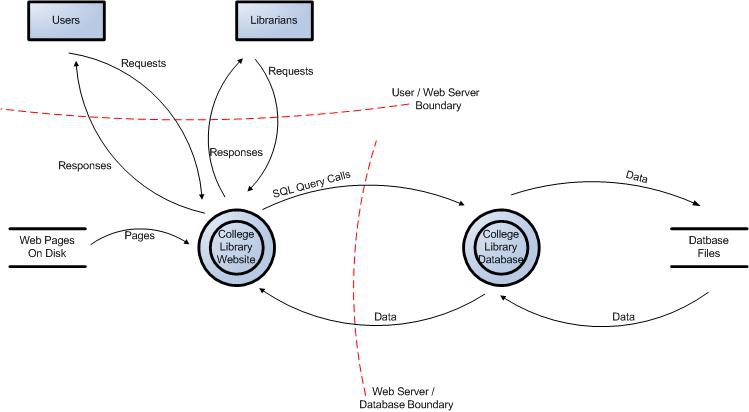
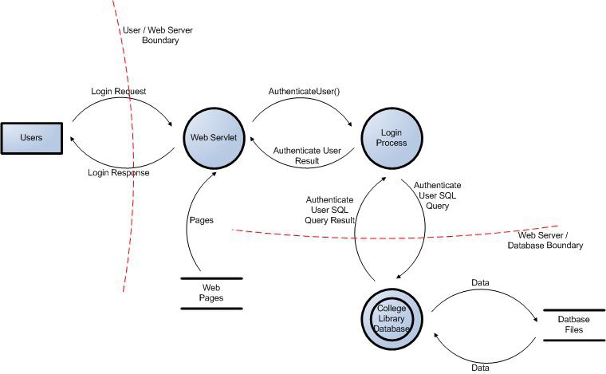

> **来源与授权**：本文全文译自 [OWASP Cheat Sheet Series：Threat Modeling Cheat Sheet](https://cheatsheetseries.owasp.org/cheatsheets/Threat_Modeling_Cheat_Sheet.html)，原作者为 OWASP Cheat Sheet Series 贡献者。原文及本文译文采用 [CC BY-SA 4.0](https://github.com/OWASP/CheatSheetSeries/blob/master/LICENSE.md)。采集于 2026 年 10 月 8 日。
>
> **整理说明**：中文翻译由 Thirty Before 整理，并非 OWASP 官方中文版本；保留原文各节、表格与参考链接。[英文原文](source.txt)可供核对。文中两张数据流图是另从 [OWASP Threat Modeling Process](https://owasp.org/www-community/Threat_Modeling_Process) 补充的插图，同样按 CC BY-SA 4.0 使用，不属于这篇速查表的原始配图。

## 引言

威胁建模是现代应用开发者需要理解的一项重要概念。这份速查表为刚接触威胁建模的人，以及希望重新梳理知识的人，提供简洁、可执行的参考。有关威胁建模各方面的更多资料，可参阅 [OWASP Threat Modeling 项目](https://owasp.org/projects/threat-modeling-project?tab=application-threat-modeling)。

## 概述

在应用安全领域，威胁建模是一种有结构、可重复的过程，用于了解特定系统的安全特征，并据此采取行动。它包括从安全角度建立系统模型、根据模型识别适用的威胁，以及确定如何应对这些威胁。威胁建模从对抗者的角度分析系统，关注攻击者可能利用系统的方式。

理想情况下，应在软件开发生命周期（SDLC）的早期，例如设计阶段，开展威胁建模。它也不是完成一次就可以放下的工作：威胁模型需要随系统一起维护、更新和完善。团队应把它融入日常开发流程，作为常规、必要的步骤。

按照[《威胁建模宣言》](https://www.threatmodelingmanifesto.org/)，威胁建模过程应回答四个问题：

1. 我们正在做什么？
2. 可能出什么问题？
3. 我们打算如何处理？
4. 我们做得足够好吗？

下面介绍的四个主要阶段以这些问题为基础。

## 威胁建模的好处

在介绍流程之前，先回答一个实际问题：为什么要在开发过程中加入威胁建模？这项工作有哪些收益？

### 提早识别风险

威胁建模力求在设计阶段发现潜在的安全问题，让安全要求融入系统设计。与系统投入生产后才发现、修复安全缺陷相比，这样通常更有效率。

### 增强安全意识

做好威胁建模，需要参与者结合具体应用，创造性地思考安全问题，并作出审慎判断。它要求人们尝试从攻击者的角度看问题，把一般的安全知识用于具体情境。威胁建模通常由团队共同开展，鼓励成员分享想法，对他人的观点提出反馈，因此也可以成为一项有助于学习的活动。

### 更深入地了解评估对象

威胁建模要求深入理解被评估的系统，包括数据流、信任边界及其他系统特征。因此，它也能帮助团队更清楚地认识系统本身及其交互关系。

## 逐一回答四个问题

威胁建模没有一个被行业普遍接受、适用于所有场景的标准流程。不过，大多数方法都以某种形式包含系统建模、威胁识别和风险应对。根据这些共同点以及前面的四个问题，本速查表将过程划分为四个基本步骤：应用拆解、威胁识别与排序、缓解措施、评审与验证。

另一些流程与这种划分并不完全对应，例如攻击模拟与威胁分析过程（PASTA），以及面向关键资产的组织风险评估方法 OCTAVE；这些方法也各有支持者。

### 系统建模

这一步回答“我们正在构建什么”。只有理解系统，才能判断哪些威胁与它最相关，因此系统建模是后续工作的基础。第一步可以采用多种技术，其中数据流图（DFD）是较常用的方法。

DFD 以图形呈现系统、数据流，以及与外部实体的交互。可以用绘图工具或白板创建，并保存为团队能够持续更新的形式。对于复杂系统，可以先画整体概览，再为各组件绘制更详细的图。

无论采用 DFD 还是其他模型，都应清楚展示信任边界、数据流、数据存储、处理过程，以及可能与系统交互的外部实体。这些位置常常是潜在的攻击点，也是后续分析的重要输入。

*补充示例：OWASP 大学图书馆网站的数据流图。来源为 Threat Modeling Process 的 Figure 1，用于帮助理解系统层面的数据流与边界。*

*补充示例：同一案例的用户登录过程，来源为 Threat Modeling Process 的 Figure 2，展示更细的分析层次。*

另一种梳理系统的方法是头脑风暴，它适合产生想法、理解项目领域。这样做有助于提高团队参与度，统一知识和术语，形成对业务领域的共同认识，并迅速识别关键过程及依赖关系。它的优点之一是灵活，能够适应包括业务逻辑在内的多种场景。对技术背景较少的参与者而言，这种方式也能降低理解 DFD 元素及绘制规则的门槛。

头脑风暴让每个参与者都有机会贡献意见，改善沟通和对问题的共同理解，增强责任感与参与感。团队可以在讨论中共同定义关键术语和概念，形成统一的项目用语。这对不同团队可能采用不同术语的复杂项目尤其有帮助。讨论过程中，团队也能较快地识别关键业务流程及其相互关系。

把头脑风暴的结果与正式建模技术结合起来，可以加深对业务领域的理解，并帮助设计系统。

### 云环境中的威胁建模

现代系统中有许多采用云原生或混合架构。STRIDE、DFD 等传统方法通常需要调整，以适应云架构带来的以下因素：

- 责任共担模型；
- 托管服务和 API；
- 多租户与身份联邦；
- 动态基础设施，包括基础设施即代码（IaC）、无服务器计算和容器。

云原生系统的分布式、面向服务的特点，以及责任共担模型，会引入特别需要考虑的事项：

- **云架构组件**：虚拟网络、IAM 角色、托管服务和存储桶。
- **责任共担**：分清哪些安全控制由服务提供商负责，哪些由客户负责。
- **动态环境**：容器编排、无服务器函数和短暂存在的基础设施。
- **合规与数据驻留**：确保工作负载符合适用地区的法律和隐私要求。

### 威胁识别

建立系统模型后，就可以回答“可能出什么问题”。应结合第一步的输入，在被评估系统的具体情境中识别威胁并进行排序。可使用的数据来源和技术很多。这里以 STRIDE 为例；实际工作中，也可以将其他方法与 STRIDE 结合，或使用其他方法替代它。

STRIDE 是一项成熟、常用的威胁建模技术，最初由微软员工提出，其名称也是一个助记词。它将威胁分为六类，作为系统化思考的提示，帮助工程师分析这些威胁在具体系统中如何出现。每类威胁都对应某项安全属性遭到破坏：

| 威胁类别 | 被破坏的安全属性 | 例子 |
| --- | --- | --- |
| **S**poofing，身份伪冒 | 身份认证 | 攻击者窃取合法用户的认证令牌，并以该用户的身份行动。 |
| **T**ampering，篡改 | 完整性 | 攻击者滥用应用，对数据库执行非预期的更新。 |
| **R**epudiation，抵赖 | 行为记录与可追责性（原文：Accounting） | 攻击者修改日志，以掩盖自己的行为。 |
| **I**nformation Disclosure，信息泄露 | 保密性 | 攻击者从存有用户账户信息的数据库中提取数据。 |
| **D**enial of Service，拒绝服务 | 可用性 | 攻击者反复发起失败的认证尝试，使合法用户的账户被锁定。 |
| **E**levation of Privileges，权限提升 | 授权 | 攻击者篡改 JWT，尝试改变自己的角色。 |

审查系统模型时，可以用这六类威胁作为提示，与团队一起讨论，并记录每项威胁影响的组件、数据流或信任边界。

识别可能的威胁后，人们通常还会对其排序。理论上，可以依据威胁发生可能性与影响程度的乘积来评估：容易发生、损失严重的威胁，其优先级应高于不易发生、影响较小的威胁。不过，这两项因素都可能难以计算，而且这种做法没有计入修复成本。也有人主张将修复工作量纳入统一的优先级评估。

#### 选择威胁建模技术

针对技术设计，可以先使用 STRIDE；如果分析范围需要不同视角，则选择其他技术。[卡内基梅隆大学软件工程研究所（SEI）的威胁建模方法比较](https://www.sei.cmu.edu/library/threat-modeling-a-summary-of-available-methods/)指出，各种方法关注的问题不同，也可以组合使用。

| 团队需要分析什么 | 可考虑的方法 | 如何使用 |
| --- | --- | --- |
| 技术设计中的安全威胁 | STRIDE | 对组件、数据流和信任边界逐一应用六类威胁提示。 |
| 高价值的攻击目标或多步骤攻击 | 攻击树 | 从攻击者的目标出发，拆解达成目标所需的路径或可选路径。 |
| 对正常工作流程或业务规则的滥用 | 误用或滥用案例 | 探索乱序、重复、并发执行的操作，或产生非预期结果的操作。 |
| 隐私属性与隐私损害 | [LINDDUN](https://linddun.org/threat-types/) | 使用隐私专用提示，分析关联、识别、不可抵赖、可检测、数据披露、不知情及无法干预、不合规等问题；STRIDE 的安全属性不能完全覆盖这些问题。 |
| 与业务影响有关的应用威胁 | PASTA | 将业务目标和技术需求与应用威胁联系起来。 |
| 组织关键资产面临的整体风险 | OCTAVE | 评估组织风险，为关键资产制定安全策略。 |
| 跨多个团队的应用威胁与运营威胁 | VAST（Visual、Agile、Simple Threat Modeling） | 在开发流程中分别维护应用威胁模型与运营威胁模型。 |

每引入一种方法，都应说明它为什么适合当前分析范围，并记录它未能覆盖的问题；不应仅为显得全面而增加方法。

### 应对与缓解措施

了解系统及相关威胁后，需要回答“我们打算如何处理”。此前识别的每项威胁都应有应对方式。威胁应对与风险应对相似，但不完全相同。Adam Shostack 列出了以下方式：

- **缓解**：采取行动，降低威胁实际发生的可能性。
- **消除**：移除产生威胁的功能或组件。
- **转移**：通过合同或财务安排，将责任分配给另一方。[风险转移本身不会降低事件发生的可能性或有害后果](https://tsapps.nist.gov/publication/get_pdf.cfm?pub_id=908030#page=52)；应记录剩余安全控制及残余风险由谁负责。
- **接受**：由于业务需求或限制，其他选项都不可接受，因此选择不缓解、不消除，也不转移该风险。

记录每项威胁的应对决定，并把达成一致的缓解措施转化为可执行的安全需求。说明团队将如何实施每项措施，以及为什么接受剩余风险。根据 [NIST SP 800-218 的 PW.1.2 实践](https://nvlpubs.nist.gov/nistpubs/specialpublications/nist.sp.800-218.pdf#page=20)，这些决定应随系统变化保持更新。

### 评审与验证

最后一个问题是“我们做得足够好吗”。威胁模型应由所有利益相关方共同评审，参与者不应仅限于开发团队或安全团队。评审应重点关注：

- DFD 或其他模型是否准确反映系统？
- 是否识别了所有威胁？
- 是否为每项已识别威胁确定了应对策略？
- 对选择缓解的威胁，是否制定了将风险降至可接受水平的措施？
- 威胁模型是否已形成正式文档？建模过程的产物是否以适当方式保存，供需要知情的人访问？
- 商定的措施是否可以测试？能否衡量威胁模型提出的需求和建议是否落实成功？

## 威胁建模与开发团队

### 面临的困难

开发团队开展威胁建模可能遇到几个主要困难。首先，部分开发者缺乏安全领域的知识和经验，难以有效使用相关方法和框架，识别威胁并建立模型。如果没有适当培训，也不了解基本安全原则，就可能遗漏威胁或错误评估风险。

其次，威胁建模可能复杂且耗时。它要求系统化分析，并深入理解系统，这与紧张的交付安排及新增功能的压力可能发生冲突。如果团队缺少支持这项工作的工具和资源，也容易产生挫败感。

另一个困难是组织内不同部门之间的沟通与合作。开发团队、安全团队和其他利益相关方之间如果不能有效沟通，威胁建模就可能不完整，或偏离实际问题。

### 如何应对这些困难

在许多情况下，邀请安全团队成员参与建模讨论可以改善过程。安全专家能够提供识别威胁、分析风险和制定缓解措施所需的知识。他们对攻击技术及其变化的了解，也能帮助开发者学习并提高能力。这类共同讨论还有助于组织内的合作，形成更全面的安全分析。

组织应定期为开发团队安排信息安全培训，由专家授课，并根据团队的具体需要调整内容。也可以采用简化或自动化威胁建模过程的工具与流程，辅助识别和评估威胁，使工作更容易开展，减少所需时间。

组织还应让安全成为共同关注的工作，使威胁建模成为 SDLC 的组成部分。定期评审和跨团队研讨有助于改善合作与沟通，使威胁建模更加有效、完整。通过这些措施，团队可以降低这项工作的负担，让它为系统安全带来实际收益。

## 参考资料

- [Threat Modeling Manifesto](https://www.threatmodelingmanifesto.org/)
- [SEI：Threat Modeling — A Summary of Available Methods](https://www.sei.cmu.edu/library/threat-modeling-a-summary-of-available-methods/)
- [NIST SP 800-218：Secure Software Development Framework](https://nvlpubs.nist.gov/nistpubs/SpecialPublications/NIST.SP.800-218.pdf)

## 原文、许可与配图下载

- [英文原文快照](source.txt)
- [原项目许可文件](LICENSE.txt)
- [大学图书馆网站数据流图](images/library-data-flow.jpg)
- [用户登录过程数据流图](images/login-data-flow.jpg)

继续转载这篇译文时，应保留 OWASP 原作者、来源、修改说明与 CC BY-SA 4.0 许可；配图的来源说明也应保留。

- [下载三篇文章的 Markdown 与配图合集](/downloads/technical-reading.zip)
